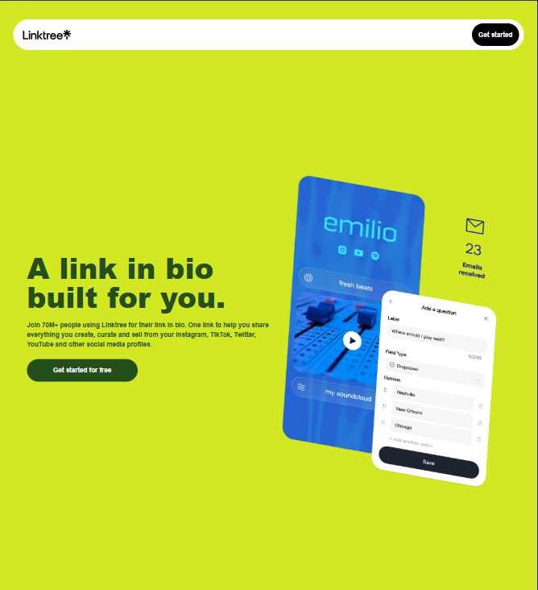
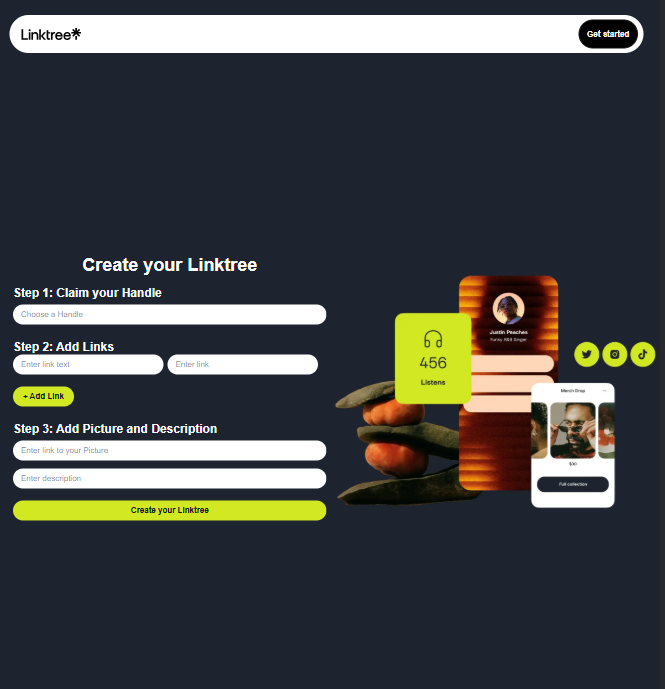
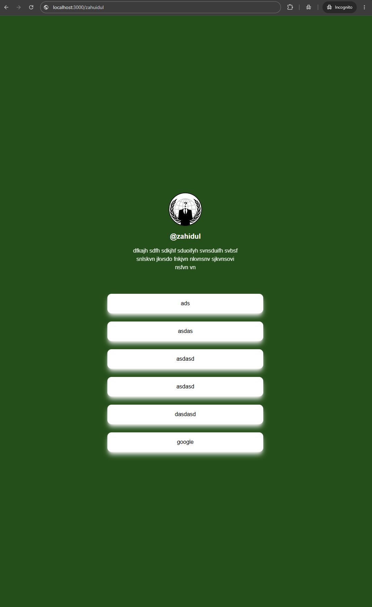

# 🌳 Linktree Clone

> A beautiful Linktree-style bio link page builder built with **Next.js + React + MongoDB**.

Create your own personalized link page — just like Linktree — where you can showcase all your social media accounts, websites, and important links in one clean, shareable page. All data stays **100% local** on your machine.

---

## Features

- **Add Multiple Links** — Add all your social accounts and important URLs
- **Personalized Profile Page** — Custom handle-based public page (e.g., `/yourname`)
- **Profile Info** — Display your name, bio, and profile picture
- **Copy Links** — One-click copy for any link
- **Clean UI** — Minimal, modern, and responsive design
- **Landing Page** — Beautiful homepage to create your link page
- **Fully Local** — Everything runs on your own computer

---

## Tech Stack

| Technology | Purpose |
|-----------|---------|
| [Next.js](https://nextjs.org/) | React Framework & Routing |
| [React](https://react.dev/) | UI Library |
| [MongoDB](https://www.mongodb.com/) | Database for storing links & profiles |
| [Tailwind CSS](https://tailwindcss.com/) | Styling |

---

## Getting Started

Follow these steps to run the project locally on your machine.

### Prerequisites

Make sure you have the following installed:

- [Node.js](https://nodejs.org/) (v18 or higher recommended)
- [MongoDB](https://www.mongodb.com/try/download/community) (running locally)

### 1. Clone the Repository

```bash
git clone https://github.com/Zahid207/Linktree-Clone.git
cd Linktree-Clone
```

### 2. Install Dependencies

```bash
npm install
```

### 3. Configure Environment Variables

Create a `.env.local` file in the root directory and add your MongoDB connection:

```env
MONGODB_URI=mongodb://localhost:27017/linktree
NEXT_PUBLIC_HOST=http://localhost:3000
```

> **Note:** This is a local project. MongoDB runs on your own machine, so your data never leaves your computer.

### 4. Start the Development Server

```bash
npm run dev
```

The app will be available at `http://localhost:3000`

### 5. Build for Production

```bash
npm run build
```

---

## Project Structure

```
Linktree-Clone/
├── app/
│   ├── [handle]/              # Dynamic route for user profile pages (page.js)
│   ├── api/
│   │   └── add/               # API route to save links & profile (route.js)
│   ├── generate/              # Link generation form page (page.js)
│   ├── globals.css            # Tailwind global styles
│   ├── layout.js              # Root layout
│   └── page.js                # Landing page
├── components/
│   └── Navbar.js              # Navigation component
├── lib/
│   └── mongodb.js             # MongoDB connection configuration
├── public/                    # Static assets
├── screenShoot/               # Screenshots folder
│   ├── form_fill_up_page.png
│   ├── landing_page.png
│   └── linktree_page.png
├── .env.local                 # Environment variables
├── next.config.mjs            # Next.js configuration
└── package.json               # Dependencies
```

---

## 
 How to Use

1. **Open the App**
   - Go to `http://localhost:3000`

2. **Fill Your Profile**
   - Enter your name, bio, and profile picture URL
   - Add your social media links (Facebook, Instagram, Twitter, GitHub, etc.)
   - Choose a custom handle (e.g., `zahid`)

3. **Generate Your Page**
   - Click **Generate** to create your personalized link page

4. **Share Your Link**
   - Your page will be available at `http://localhost:3000/zahid`
   - Share this link with anyone!

5. **Visit Any Profile**
   - Just go to `http://localhost:3000/[handle]` to view any created profile

---

## Screenshots

### Landing Page
The main page where users can fill in their details and generate their personalized link page.



### Form Fill-Up Page
The form to enter profile information and add social media links.



### Generated Linktree Page
The final personalized page that others can visit to see all your links.



---

## Privacy Note

Since this app runs **locally**:

- All data is stored on your own MongoDB instance
- No third-party service has access to your links
- You fully own and control your data
- Nothing is uploaded to the cloud


---

<p align="center">
  <sub>Made with a lot of ❤️ Love and Care 😊 by <strong>Zahidul</strong></sub>
</p>
